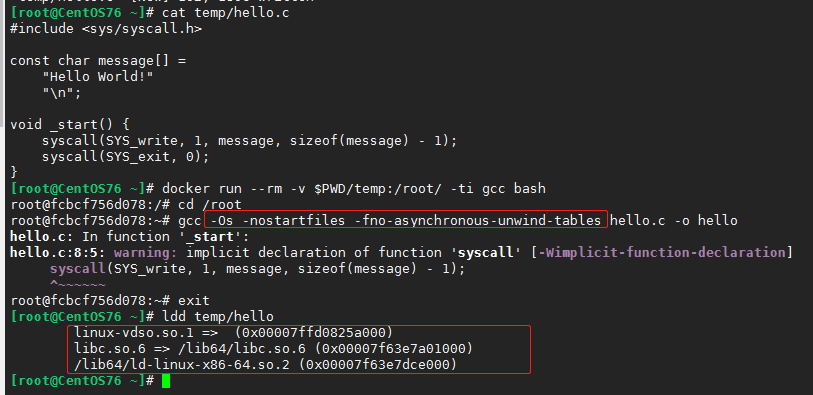

# 3.容器无法运行排错

其实大部分的都在前面的CMD里讲了原因


### Exited \(0\) 

自己做的镜像的话是没有前台运行，主进程没维持容器存活

官方镜像的话多半是\(或者你挂载的\)配置文件或者自己传入的启动参数导致没前台运行，就像前面说的例如redis配置文件里写日志文件路径会导致非前台运行

### Exited \(非0\)

错在你，你是不是挂载了配置文件或者目录了？entrypoint 或者cmd覆盖了带上`-ti`选项主进程用 sh 或者bash 进去然后按照你的参数启动你的进程或者看下目录就知道了 。

```text
ENTRYPOINT ["npm"]
CMD ["run", "xxx"]
```

假设镜像的属性为上面，我们run不起来，可以下面进去后手动启动看看报错啥的，调整了后起来了把修改的步骤做到Dockerfile里

```text
docker run -ti --rm --entrypoint sh ImageName
```

（这里说一句，tomcat 和基于 tomcat 的应用正常 docker stop 的话退出码是非0的是 137 很正常，可以github上搜下原因）

也有种情况是 ulimit 数值太小，这个我之前帮人远程看 k8s 的 ingress-nginx 的无法启动，最终找到的原因

#### standard\_init\_linux.go:211: exec user process caused "exec format error"

这种情况看下镜像的`docker inspect coredns/coredns:1.1.3 -f '{{.Architecture}}'`, 执行下arch命令看看和镜像的架构是否对应得上，一般这个问题是镜像架构和系统的 cpu 架构不一致。不一致的话构建镜像的RUN阶段和起容器执行命令都会出现这个问题

#### invalid reference format while pull

多阶段构建，前面阶段构建失败，但是后面的构建还是走完了，go里编译的二进制运行就会这个错误，其他的语言不确定是不是这个错误

### sh: xxx not found

如果 entrypoint 是脚本，那第一行的 shell bang 的 shell，例如 alpine 没有 bash，你第一行声明 bash 执行就会这样。另外就下面这种情况了


这个问题就是动态链接库的原因，底层的so文件不存在，可以ldd看看你编译的二进制文件，然后在容器里按照ldd的输出查找下so存在否。

对于这个问题如果是官方的二进制文件在alpine镜像里无法运行我们可以试试这样

```text
RUN mkdir /lib64 \
    && ln -s /lib/libc.musl-x86_64.so.1 /lib64/ld-linux-x86-64.so.2
```

说到这个现在我们也顺带来探究下为啥hello-world镜像才几kb，下面是hello-world的dockerfile [https://github.com/docker-library/hello-world/blob/master/amd64/hello-world/Dockerfile](https://github.com/docker-library/hello-world/blob/master/amd64/hello-world/Dockerfile)

```text
FROM scratch
COPY hello /
CMD ["/hello"]
```

这个hello就是c语言写的编译的二进制文件，scratch就是空镜像，所有rootfs就是从空镜像构建的。我们可以在仓库上找到这个文件的源码

```text
//#include <unistd.h>
#include <sys/syscall.h>

#ifndef DOCKER_IMAGE
	#define DOCKER_IMAGE "hello-world"
#endif

#ifndef DOCKER_GREETING
	#define DOCKER_GREETING "Hello from Docker!"
#endif

#ifndef DOCKER_ARCH
	#define DOCKER_ARCH "amd64"
#endif

const char message[] =
	"\n"
	DOCKER_GREETING "\n"
	"This message shows that your installation appears to be working correctly.\n"
	"\n"
	"To generate this message, Docker took the following steps:\n"
	" 1. The Docker client contacted the Docker daemon.\n"
	" 2. The Docker daemon pulled the \"" DOCKER_IMAGE "\" image from the Docker Hub.\n"
	"    (" DOCKER_ARCH ")\n"
	" 3. The Docker daemon created a new container from that image which runs the\n"
	"    executable that produces the output you are currently reading.\n"
	" 4. The Docker daemon streamed that output to the Docker client, which sent it\n"
	"    to your terminal.\n"
	"\n"
	"To try something more ambitious, you can run an Ubuntu container with:\n"
	" $ docker run -it ubuntu bash\n"
	"\n"
	"Share images, automate workflows, and more with a free Docker ID:\n"
	" https://hub.docker.com/\n"
	"\n"
	"For more examples and ideas, visit:\n"
	" https://docs.docker.com/get-started/\n"
	"\n";

void _start() {
	//write(1, message, sizeof(message) - 1);
	syscall(SYS_write, 1, message, sizeof(message) - 1);

	//_exit(0);
	syscall(SYS_exit, 0);
}
```

官方的cmakefile里我们可以找到编译用的gcc，编译参数为

```text
CFLAGS := -static -Os -nostartfiles -fno-asynchronous-unwind-tables
```

先说着这几个编译参数的作用

* `-static`表示静态链接，虽然对这个程序来说无所谓动态链接还是静态链接……，可以理解为不依赖动态链接库了，全部打包了；
* `-Os`表示为空间进行`-O2`级别的优化，专门用于减少目标文件大小；
* `-nostartfiles`是关键编译选项，此选项表示不使用标准C语言运行库（即`crt0.o`），也不链接C标准库；
* `-fno-asynchronous-unwind-tables`选项也是用于减少代码空间的，其大概含义是不产生C++异常处理机制中使用的`.eh_frame`段，关于什么是`unwind-tables`和`.eh_frame`是个比这篇文章复杂多了的问题；
* 上面选项参考来源于[What is the use of \_start\(\) in C?](https://stackoverflow.com/questions/29694564/what-is-the-use-of-start-in-c)

  [When is the gcc flag -nostartfiles used?](https://stackoverflow.com/questions/43050089/when-is-the-gcc-flag-nostartfiles-used)

  [GCC x86 code size optimizations](https://software.intel.com/en-us/blogs/2013/01/17/x86-gcc-code-size-optimizations)

  [c++ 异常处理（2）](https://www.cnblogs.com/catch/p/3619379.html)

 官方的代码比较多余，我们整个简单的

```text
#include <sys/syscall.h>

const char message[] =
    "Hello World!"
    "\n";

void _start() {
    syscall(SYS_write, 1, message, sizeof(message) - 1);
    syscall(SYS_exit, 0);
}
```

既然是讲docker，我们跑一个gcc容器去构建二进制文件吧，挂载目录，容器里编译\(忽略警告\)，我们故意不带-static可以方便我们ldd看动态链接库的so



然后用编译的hello做个我们自己的hello-world镜像（当然肯定是跑不起来的- -）


虽然报错不一样，但是我们看到是跑不起来的（虽说和那个报错不一样，但是本质是一样的），其实上面这个测试步骤如果会多阶段构建的话不用那么繁琐。

下面就是针对这个测试步骤写的一个多阶段构建，第一阶段构建了个二进制文件，第二阶段直接从第一阶段拷贝过来\(图里的$name写字符串，不需要带美元符\)


同时我们也使用了ARG动态传入构建的参数，最终可以看到可以运行。

golang的话会发现实际的项目中放到alpine还是无法运行，是因为cgo没关闭，这里可以参考下面多阶段构建，编译的时候关闭CGO

```text
[root@centos7 OverTimeWork]# ll
total 32
drwxr-xr-x 2 root root    38 Aug 30 15:11 api
-rw-r--r-- 1 root root   348 Aug 30 16:15 Dockerfile
-rw-r--r-- 1 root root   183 Aug 30 16:19 go.mod
-rw-r--r-- 1 root root 16788 Aug 30 16:19 go.sum
-rw-r--r-- 1 root root  1289 Aug 30 16:19 main.go
drwxr-xr-x 2 root root    25 Aug 30 15:11 model
drwxr-xr-x 2 root root    37 Aug 30 15:11 service
[root@centos7 OverTimeWork]# cat Dockerfile 
FROM golang:latest as builder

WORKDIR $GOPATH/src/OverTimeWork
COPY . $GOPATH/src/OverTimeWork
ENV GO111MODULE=on 
ARG GOPROXY=https://mirrors.aliyun.com/goproxy/
#ARG GOPROXY=https://goproxy.io
RUN CGO_ENABLED=0 go build -o /root/main main.go


FROM alpine:latest
WORKDIR /root
COPY --from=builder /root/main .
EXPOSE 8080
ENTRYPOINT ["./main"]
```

留个作业: docker 跑一个gcc然后构建加-static编译出的hello用ldd输出还会看到so路径吗？

另外推荐一个文章，涉及到so的一个非常棒的文章[https://docs.lvrui.io/2018/10/19/%E4%B8%BA%E5%AE%B9%E5%99%A8%E9%95%9C%E5%83%8F%E5%AE%9A%E5%88%B6%E5%AE%89%E8%A3%85Linux%E5%B7%A5%E5%85%B7/](https://docs.lvrui.io/2018/10/19/%E4%B8%BA%E5%AE%B9%E5%99%A8%E9%95%9C%E5%83%8F%E5%AE%9A%E5%88%B6%E5%AE%89%E8%A3%85Linux%E5%B7%A5%E5%85%B7/)

### unkown option -x xxx

这个问题几句话就简单讲清楚了


这个是因为bash的引号保持了整体性，出现这个问题的原因在于你的CMD或者ENTRYPOINT是选项和参数啥的没分开写，例如下面

```text
ENTRYPOINT ["xxx","-a  dfg  -d sadased"]
```

解决办法是全部分开写

```text
ENTRYPOINT ["xxx","-a","dfg","-d","sadased"]
```

同理后续docker-compose或者k8s的给容器的command和args覆盖成指定的时候，你可能写成下面类似的

```text
command: npm run start
```

因为是yaml，command和args都是数组，一行就是一个元素了，应该写成下面这样

```text
command: ["npm", "run", "start"] # 或者下面
command:
  - npm
  - run
  - start
```

第一种情况遇到的比较多，可以主进程sh或者bash进去排查，后两种看一遍就知道了。

#### k8s的pod exit非0调试

pod一直crash的话，我们把command用下面这个，生存探针啥的全部注释掉。command用bash，tail之类的会在调试完成delete kill的时候阻塞住，参考 [infinite blockings](https://stackoverflow.com/questions/2935183/bash-infinite-sleep-infinite-blocking) 。

```text
["bash", "-c", "coproc { exec >&-; read; }; eval exec \"${COPROC[0]}<&-\"; wait"
```

### segmentation fault

这个其实大多数情况和代码没关系，一般是安全软件导致的，极少数情况下是关机导致镜像损坏了。

